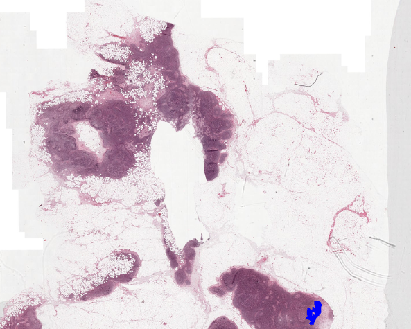

# camelyon


### Initialization of WholeSlideImage class
```python
>>> from core.data_model import WholeSlideImage
>>> slide_image = WholeSlideImage(
>>>     ".../CAMELYON16/images/tumor_001.tif",
>>>     annotation_path=".../CAMELYON16/annotations/tumor_001.xml"
>>> )

>>> slide_image
WholeSlideImage(name=tumor_001, center=RUMC)

# View thumbnail
>>> slide_image.get_thumbnail()
```


### Tiling WSI with annotation
```python
>>> ployglons = slide_image.get_polygons()
>>> ployglons[0]
Polygon PIL.Image

>>> patches = slide_image.tile_with_annotation(
    ployglons, 
    label=Labels.MALIGNANT,
    patch_size=512, 
    level=1, 
    verbose=True
)
>>> patches
Patches(len=33, malignant(33), benign(0))

>>> patches.save("some_dir")
```

### Tiling with filter
```python
>>> from core.data_model import Labels
>>> from core.patch_filter import PatchFilter
>>> patch_filter = PatchFilter()
>>> patch_filter.add_intersection_over_patch(ployglons) # add filter option
>>> patches = slide_image.tile_with_annotation(
    ployglons, 
    label=Labels.MALIGNANT,
    patch_size=512, 
    level=1, 
    patch_filter=patch_filter,  # add filter
    verbose=True
)
>>> patches
Patches(len=17, malignant(17), benign(0))
```

### Tile without annotation for Benign WSI
```python
>>> from core.patch_filter import PatchFilter
>>> patch_filter = PatchFilter()
>>> patch_filter.add_hvs_foregorund_ratio()
>>> slide_image = WholeSlideImage(
    ".../Camelyon_Challenge/CAMELYON16/images/normal_001.tif",
)
>>> patches = slide_image.tile_without_annotation(
    512,
    level=1,
    patch_filter=patch_filter,
)
100%|██████████| 216/216 [06:52<00:00,  1.91s/it]
```

### Tile without holding in memory
```python
>>> from core.patch_filter import PatchFilter
>>> patch_filter = PatchFilter()
>>> patch_filter.add_hvs_foregorund_ratio()
>>> slide_image = WholeSlideImage(
    ".../Camelyon_Challenge/CAMELYON16/images/normal_001.tif",
)
>>> slide_image.tile_without_annotation(
    512,
    level=1,
    patch_filter=patch_filter,
    save_dir="slide_name"
)
100%|██████████| 216/216 [06:52<00:00,  1.91s/it]
```

#### Save Patch
Patch with CLI
```bash
$ python3 tiling.py \
    -i .../Camelyon_Challenge \
    -o ./data

$ tree -L ./data
data/
├── readme
├── ucmc
└── rumc
```
